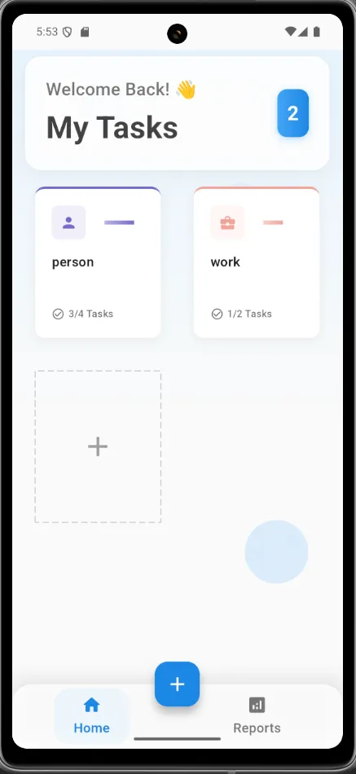
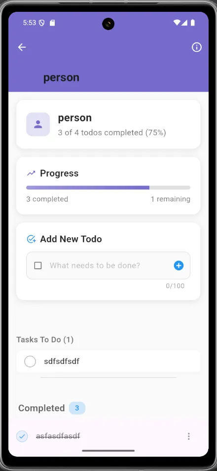
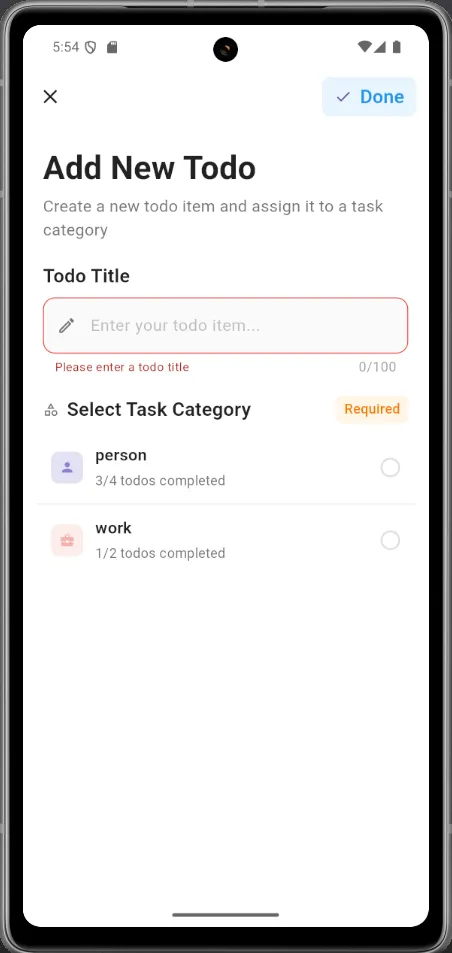
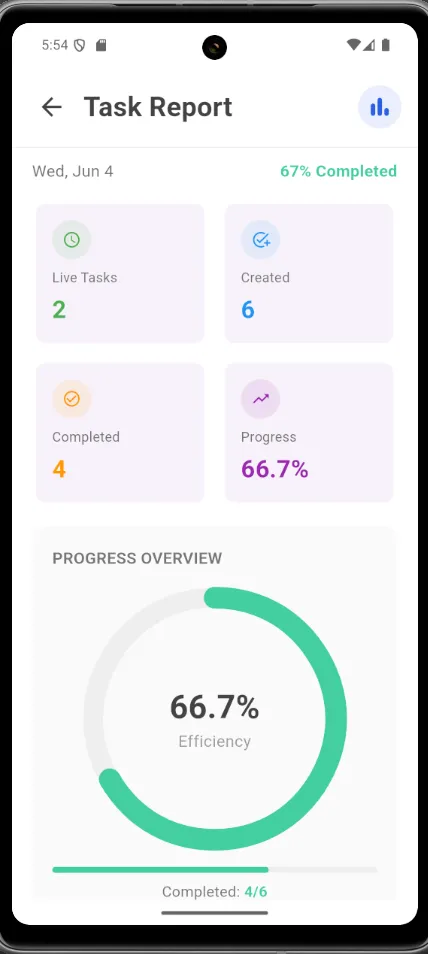

# GetX TodoList App 📋

Aplikasi Flutter untuk mengelola tugas harian dengan sistem kategori dan tracking progress menggunakan GetX state management.

## 📱 Screenshots

### 1. Home Screen - Dashboard Utama


Dashboard utama menampilkan:
- Pesan selamat datang "Welcome Back! 👋"
- Total tugas aktif (2 tugas)
- Kategori tugas:
  - **Person**: 3/4 tugas selesai
  - **Work**: 1/2 tugas selesai
- Tombol untuk menambah kategori baru
- Navigasi bottom bar (Home, Reports)

### 2. Detail Kategori - Person


Halaman detail kategori "Person" menunjukkan:
- Progress bar: 3 dari 4 todos selesai (75%)
- Form "Add New Todo" untuk menambah tugas baru
- Daftar tugas:
  - **Tasks To Do (1)**: sdfsdfsdf
  - **Completed (3)**: asfasdfasdf (dengan centang)

### 3. Form Tambah Tugas


Form untuk menambahkan tugas baru:
- **Todo Title**: Input field untuk judul tugas
- **Select Task Category** (Required): 
  - Person (3/4 todos completed)
  - Work (1/2 todos completed)
- Validasi: "Please enter a todo title"
- Counter karakter: 0/100

### 4. Laporan Progress


Dashboard laporan menampilkan:
- Tanggal: Wed, Jun 4
- **Overall Progress**: 67% Completed
- Statistik ringkasan:
  - **Live Tasks**: 2
  - **Created**: 6
  - **Completed**: 4
  - **Progress**: 66.7%
- **Progress Overview**: Circular chart menunjukkan 66.7% Efficiency
- Status: Completed 4/6

## 🚀 Fitur Utama

### ✅ Manajemen Tugas
- Membuat, mengedit, dan menghapus tugas
- Menandai tugas sebagai selesai/belum selesai
- Sistem kategori untuk mengorganisir tugas (Person, Work)

### 📊 Tracking Progress
- Progress bar real-time untuk setiap kategori
- Dashboard laporan dengan statistik lengkap
- Circular progress chart untuk visualisasi efisiensi
- Perhitungan persentase otomatis

### 🎨 User Interface
- Desain modern dan minimalis
- Warna-warna yang menarik (ungu untuk Person, merah untuk Work)
- Bottom navigation yang mudah diakses
- Form input yang user-friendly

### 📱 Mobile-First Design
- Responsive design untuk mobile
- Touch-friendly interface
- Smooth navigation antar halaman

## 🛠️ Teknologi yang Digunakan

- **Framework**: Flutter
- **Language**: Dart
- **State Management**: GetX
- **UI Components**: Material Design 3
- **Storage**: SQLite / Shared Preferences
- **Architecture**: MVC with GetX Pattern

## 🚀 Instalasi dan Setup

### Prerequisites
- Flutter SDK (>=3.0.0)
- Dart SDK (>=2.17.0)
- Android Studio / VS Code
- Git

### Installation Steps

1. **Clone repository**
```bash
git clone https://github.com/yourusername/task-management-app.git
cd task-management-app
```

2. **Install dependencies**
```bash
flutter pub get
```

3. **Run the app**
```bash
flutter run
```

### Dependencies

Tambahkan dependencies berikut ke `pubspec.yaml`:

```yaml
dependencies:
  flutter:
    sdk: flutter
  get: ^4.6.5
  get_storage: ^2.1.1
  intl: ^0.18.1
  
dev_dependencies:
  flutter_test:
    sdk: flutter
  flutter_lints: ^2.0.0
```


### Todo Structure
```dart
// Todo item structure dalam List<dynamic>
Map<String, dynamic> todo = {
  'title': 'Task title',
  'done': false, // true untuk completed, false untuk ongoing
};
```

## 🎯 HomeController Implementation

### Controller Features
```dart
class HomeController extends GetxController {
  final TaskRepository taskRepository;

  // Form and UI state
  final formKey = GlobalKey<FormState>();
  final editCtrl = TextEditingController();
  final tabIndex = 0.obs;
  final chipIndex = 0.obs;
  final deleting = false.obs;

  // Task and todo data
  final tasks = <Task>[].obs;
  final task = Rx<Task?>(null);
  final doingTodos = <dynamic>[].obs;
  final doneTodos = <dynamic>[].obs;

  @override
  void onInit() {
    super.onInit();
    _loadTasks();
    _setupTaskWatcher();
  }

  // Task Management Methods
  bool addTask(Task newTask) {
    if (tasks.any((existingTask) => existingTask.title == newTask.title)) {
      return false;
    }
    tasks.add(newTask);
    return true;
  }

  void deleteTask(Task taskToDelete) {
    tasks.removeWhere((task) => task.title == taskToDelete.title);
  }

  bool updateTask(Task taskToUpdate, String newTodoTitle) {
    if (newTodoTitle.trim().isEmpty) return false;

    final todos = List<Map<String, dynamic>>.from(taskToUpdate.todos ?? []);
    
    if (todos.any((todo) => todo['title'] == newTodoTitle.trim())) {
      return false;
    }

    final newTodo = {'title': newTodoTitle.trim(), 'done': false};
    todos.add(newTodo);

    final updatedTask = taskToUpdate.copyWith(todos: todos);
    final taskIndex = tasks.indexWhere((task) => task.title == taskToUpdate.title);

    if (taskIndex != -1) {
      tasks[taskIndex] = updatedTask;
      tasks.refresh();
      return true;
    }
    return false;
  }

  // Todo Management Methods
  bool addTodo(String title) {
    if (title.trim().isEmpty) return false;

    final trimmedTitle = title.trim();
    final newTodo = {'title': trimmedTitle, 'done': false};

    final existsInDoing = doingTodos.any((element) =>
        element is Map<String, dynamic> && element['title'] == trimmedTitle);
    final existsInDone = doneTodos.any((element) =>
        element is Map<String, dynamic> && element['title'] == trimmedTitle);

    if (existsInDoing || existsInDone) return false;

    doingTodos.add(newTodo);
    return true;
  }

  void doneTodo(String title) {
    final trimmedTitle = title.trim();
    final index = doingTodos.indexWhere((element) =>
        element is Map<String, dynamic> && element['title'] == trimmedTitle);

    if (index != -1) {
      doingTodos.removeAt(index);
      final doneTodo = {'title': trimmedTitle, 'done': true};
      doneTodos.add(doneTodo);
      doingTodos.refresh();
      doneTodos.refresh();
    }
  }

  void uncompleteTodo(Map<String, dynamic> todo) {
    final index = doneTodos.indexWhere((element) =>
        element is Map<String, dynamic> && element['title'] == todo['title']);

    if (index != -1) {
      doneTodos.removeAt(index);
      final updatedTodo = {'title': todo['title'], 'done': false};
      doingTodos.add(updatedTodo);
      
      // Update UI and show notification
      doingTodos.refresh();
      doneTodos.refresh();
      
      Get.snackbar(
        'Task Dipulihkan',
        'Tugas "${todo['title']}" telah dikembalikan ke daftar aktif',
        snackPosition: SnackPosition.BOTTOM,
        backgroundColor: Colors.green.withOpacity(0.9),
        colorText: Colors.white,
      );
    }
  }

  // Utility Methods
  double getTaskProgress(Task task) {
    final total = getTotalTodos(task);
    if (total == 0) return 0.0;
    final completed = getDoneTodo(task);
    return completed / total;
  }

  int getDoneTodo(Task task) {
    if (task.todos == null || task.todos!.isEmpty) return 0;
    return task.todos!
        .where((todo) => todo is Map<String, dynamic> && todo['done'] == true)
        .length;
  }

  int getTotalTodos(Task task) => task.todos?.length ?? 0;

  int getTotalTask() {
    return tasks.fold<int>(
      0,
      (previousValue, task) => previousValue + (task.todos?.length ?? 0),
    );
  }

  int getTotalDoneTask() {
    var res = 0;
    for (var task in tasks) {
      if (task.todos != null) {
        for (var todo in task.todos!) {
          if (todo is Map<String, dynamic> && todo['done'] == true) {
            res++;
          }
        }
      }
    }
    return res;
  }
}
```

### 1. Dashboard Utama
- Lihat ringkasan semua kategori tugas
- Akses quick stats dari setiap kategori
- Navigate ke detail kategori atau laporan

### 2. Mengelola Tugas
1. Pilih kategori yang diinginkan (Person/Work)
2. Lihat progress dan daftar tugas
3. Tambah tugas baru dengan tombol "Add New Todo"
4. Tandai tugas selesai dengan mencentang

### 3. Menambah Tugas Baru
1. Klik tombol "+" atau "Add New Todo"
2. Masukkan judul tugas (max 100 karakter)
3. Pilih kategori (Person/Work)
4. Klik "Done" untuk menyimpan

### 4. Melihat Laporan
1. Navigate ke tab "Reports"
2. Lihat statistik harian dan progress keseluruhan
3. Analisis efisiensi melalui circular chart

## 📸 Cara Menambahkan Screenshots

### 1. Buat folder screenshots
```bash
mkdir screenshots
```

### 2. Tambahkan gambar ke folder screenshots
```
screenshots/
├── home_screen.png
├── category_detail.png
├── add_task_form.png
└── progress_report.png
```

### 3. Update path gambar di README.md
```markdown


```

### 4. Untuk GitHub, pastikan gambar terupload ke repository
- Commit screenshots ke repository
- Path relatif akan otomatis ter-render di GitHub

### Tips Screenshot
- Gunakan resolusi yang konsisten
- Nama file yang deskriptif
- Format PNG untuk kualitas terbaik
- Width 300px untuk mobile mockups

### Flutter Commands
```bash
# Run in development mode
flutter run

# Run in release mode
flutter run --release

# Build APK
flutter build apk

# Build for iOS
flutter build ios

# Run tests
flutter test

# Analyze code
flutter analyze

# Format code
dart format .
```

### GetX CLI Commands (Optional)
```bash
# Install GetX CLI
dart pub global activate get_cli

# Create new page
get create page:home

# Create new controller
get create controller:task

# Generate model
get create model:task
```

Aplikasi melacak beberapa metrik penting:
- **Live Tasks**: Jumlah tugas aktif
- **Created**: Total tugas yang dibuat
- **Completed**: Jumlah tugas selesai
- **Progress Percentage**: Persentase penyelesaian
- **Efficiency Score**: Skor efisiensi berdasarkan completion rate

## 🎨 Design System

### Color Palette
- **Primary Purple**: Untuk kategori "Person"
- **Primary Red**: Untuk kategori "Work"  
- **Blue Accent**: Untuk tombol dan highlights
- **Green**: Untuk completed tasks dan success states
- **Gray Tones**: Untuk text dan backgrounds

### Typography
- **Headers**: Bold, larger font size
- **Body Text**: Regular weight, readable size
- **Metadata**: Smaller, muted text

## 🔮 Future Enhancements

Beberapa fitur yang bisa ditambahkan:
- [ ] Notifikasi dan reminder
- [ ] Kategori custom
- [ ] Due dates untuk tugas
- [ ] Prioritas tugas (High, Medium, Low)
- [ ] Dark mode
- [ ] Export data ke CSV/PDF
- [ ] Sync dengan cloud storage
- [ ] Kolaborasi tim
- [ ] Gamification (badges, streaks)


*Dokumentasi ini dibuat berdasarkan analisis interface aplikasi. Untuk informasi teknis lebih detail, silakan merujuk ke kode sumber aplikasi.*